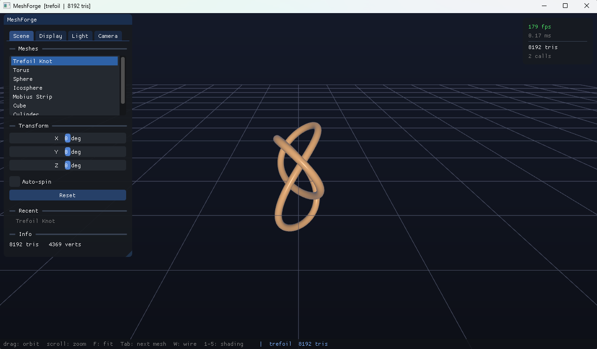
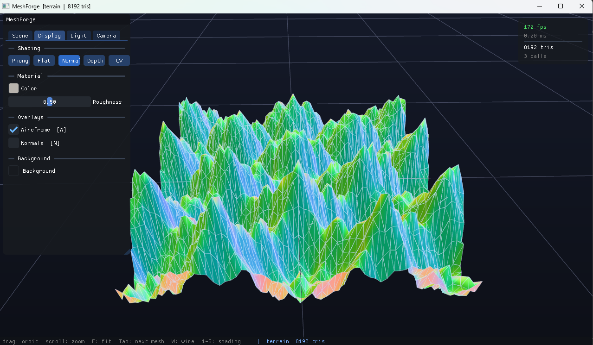

# meshforge

3D mesh viewer built from scratch in C++ — OpenGL renderer, procedural geometry, OBJ loader and ImGui interface.





## build

Requires CMake 3.16+ and a C++20 compiler. Dependencies are downloaded automatically.

```bash
mkdir build && cd build
cmake ..
cmake --build .
```

## features

- Phong shading, wireframe, normal/depth/UV visualization
- Procedural meshes — torus, sphere, trefoil knot, icosphere, möbius strip, terrain
- OBJ / MTL loader
- Orbit camera
- ImGui interface — scene, display, light and camera controls

## controls

| input | action |
|-------|--------|
| left drag | orbit |
| scroll | zoom |
| `F` | fit to model |
| `Tab` | next mesh |
| `W` | wireframe |
| `1-5` | shading mode |
| `Space` | auto-spin |
| `Q` | quit |

## license

MIT
